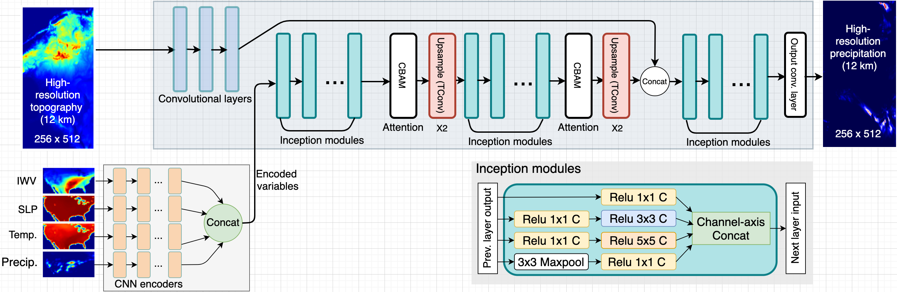

# About
This is the offical implementation of the model, a conditinal GAN for dynamic precipitation downscaling, proposed in our paper [Fast and accurate learned multiresolution dynamical downscaling for precipitation](https://doi.org/10.5194/gmd-2020-412)

# Model and Implementation 
As discussed in the manuscript, we evluated 5 different model archtecture and concluded that the `Encoded-CGAN` performed the best in different cases under different metric. So, here we only opensourced the `Encoded-CGAN`. We can consider open other implemnetaions upon request. 

We need to note that, the main purpose of this repo is to `show all implementation details` of our model proposed in the paper. 
This implementation is not fine-tuned to support new dataset straightforwardly, i.e., it is NOT an out-of-box solution for any downscaling.
Depends on your dataset, you may need to handcraft our hard-coded piece to make it work with yours.

# Dataset
The dataset used in this repo and in the manuscript can be downloaded [http://doi.org/10.5281/zenodo.4298978](https://doi.org/10.5281/zenodo.4298978)

